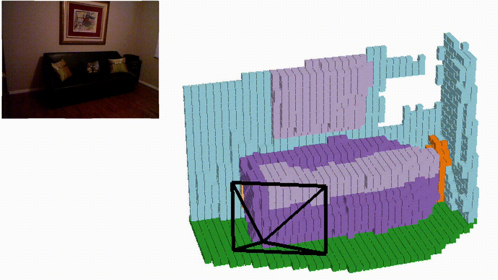

# MonoScene: Monocular 3D Semantic Scene Completion


**MonoScene: Monocular 3D Semantic Scene Completion**\
[Anh-Quan Cao](https://anhquancao.github.io),
[Raoul de Charette](https://team.inria.fr/rits/membres/raoul-de-charette/)  
Inria, Paris, France.  
CVPR 2022 \
[](https://arxiv.org/abs/2112.00726) 
[](https://astra-vision.github.io/MonoScene/)
[](https://huggingface.co/spaces/CVPR/MonoScene)

If you find this work or code useful, please cite our [paper](https://arxiv.org/abs/2112.00726) and [give this repo a star](https://github.com/astra-vision/MonoScene/stargazers):
```
@inproceedings{cao2022monoscene,
    title={MonoScene: Monocular 3D Semantic Scene Completion}, 
    author={Anh-Quan Cao and Raoul de Charette},
    booktitle={CVPR},
    year={2022}
}
```

# Teaser


|SemanticKITTI | KITTI-360 <br/>(Trained on SemanticKITTI) |
|:------------:|:------:|
|||


<p align="center">
  <b>NYUv2</b>
</p>
<p align="center">
  
</p>

# Table of Content
- [News](#news)
- [Preparing MonoScene](#preparing-monoscene)
  - [Installation](#installation)  
  - [Datasets](#datasets)
  - [Pretrained models](#pretrained-models)
- [Running MonoScene](#running-monoscene)
  - [Training](#training)
  - [Evaluating](#evaluating)
- [Inference & Visualization](#inference--visualization)
  - [Inference](#inference)
  - [Visualization](#visualization)
- [Related camera-only 3D occupancy prediction projects](#related-camera-only-3d-occupancy-prediction-projects)
- [License](#license)

# News
- 20/04/2023: Check out other [camera-only 3D occupancy prediction projects](#related-camera-only-3d-occupancy-prediction-projects).
- 28/6/2022: We added [MonoScene demo on Hugging Face](https://huggingface.co/spaces/CVPR/MonoScene) 
- 13/6/2022: We added a tutorial on [How to define viewpoint programmatically in mayavi](https://anhquancao.github.io/blog/2022/how-to-define-viewpoint-programmatically-in-mayavi/) 
- 12/6/2022: We added a guide on [how to install mayavi](https://anhquancao.github.io/blog/2022/how-to-install-mayavi-with-python-3-on-ubuntu-2004-using-pip-or-anaconda/) 
- 9/6/2022: We fixed the installation errors mentioned in https://github.com/astra-vision/MonoScene/issues/18 

# Preparing MonoScene

## Installation


1. Create conda environment:

```
$ conda create -y -n monoscene python=3.7
$ conda activate monoscene
```
2. This code was implemented with python 3.7, pytorch 1.7.1 and CUDA 10.2. Please install [PyTorch](https://pytorch.org/): 

```
$ conda install pytorch==1.7.1 torchvision==0.8.2 torchaudio==0.7.2 cudatoolkit=10.2 -c pytorch
```

3. Install the additional dependencies:

```
$ cd MonoScene/
$ pip install -r requirements.txt
```

4. Install tbb:

```
$ conda install -c bioconda tbb=2020.2
```

5. Downgrade torchmetrics to 0.6.0
```
$ pip install torchmetrics==0.6.0
```

6. Finally, install MonoScene:

```
$ pip install -e ./
```


## Datasets


### SemanticKITTI

1. You need to download

      - The **Semantic Scene Completion dataset v1.1** (SemanticKITTI voxel data (700 MB)) from [SemanticKITTI website](http://www.semantic-kitti.org/dataset.html#download)
      -  The **KITTI Odometry Benchmark calibration data** (Download odometry data set (calibration files, 1 MB)) and the **RGB images** (Download odometry data set (color, 65 GB)) from [KITTI Odometry website](http://www.cvlibs.net/datasets/kitti/eval_odometry.php).


2. Create a folder to store SemanticKITTI preprocess data at `/path/to/kitti/preprocess/folder`.

3. Store paths in environment variables for faster access (**Note: folder 'dataset' is in /path/to/semantic_kitti**):

```
$ export KITTI_PREPROCESS=/path/to/kitti/preprocess/folder
$ export KITTI_ROOT=/path/to/semantic_kitti 
```

4. Preprocess the data to generate labels at a lower scale, which are used to compute the ground truth relation matrices:

```
$ cd MonoScene/
$ python monoscene/data/semantic_kitti/preprocess.py kitti_root=$KITTI_ROOT kitti_preprocess_root=$KITTI_PREPROCESS
```

### NYUv2

1. Download the [NYUv2 dataset](https://www.rocq.inria.fr/rits_files/computer-vision/monoscene/nyu.zip).

2. Create a folder to store NYUv2 preprocess data at `/path/to/NYU/preprocess/folder`.

3. Store paths in environment variables for faster access:

```
$ export NYU_PREPROCESS=/path/to/NYU/preprocess/folder
$ export NYU_ROOT=/path/to/NYU/depthbin 
```

4. Preprocess the data to generate labels at a lower scale, which are used to compute the ground truth relation matrices:

```
$ cd MonoScene/
$ python monoscene/data/NYU/preprocess.py NYU_root=$NYU_ROOT NYU_preprocess_root=$NYU_PREPROCESS

```

### KITTI-360

1. We only perform inference on KITTI-360. You can download either the **Perspective Images for Train & Val (128G)** or the **Perspective Images for Test (1.5G)** at [http://www.cvlibs.net/datasets/kitti-360/download.php](http://www.cvlibs.net/datasets/kitti-360/download.php).

2. Create a folder to store KITTI-360 data at `/path/to/KITTI-360/folder`.

3. Store paths in environment variables for faster access:

```
$ export KITTI_360_ROOT=/path/to/KITTI-360
```

## Pretrained models

Download MonoScene pretrained models [on SemanticKITTI](https://www.rocq.inria.fr/rits_files/computer-vision/monoscene/monoscene_kitti.ckpt) and [on NYUv2](https://www.rocq.inria.fr/rits_files/computer-vision/monoscene/monoscene_nyu.ckpt), then put them in the folder `/path/to/MonoScene/trained_models`.


# Running MonoScene

## Training

To train MonoScene with SemanticKITTI, type:

### SemanticKITTI

1. Create folders to store training logs at **/path/to/kitti/logdir**.

2. Store in an environment variable:

```
$ export KITTI_LOG=/path/to/kitti/logdir
```

3. Train MonoScene using 4 GPUs with batch_size of 4 (1 item per GPU) on Semantic KITTI:

```
$ cd MonoScene/
$ python monoscene/scripts/train_monoscene.py \
    dataset=kitti \
    enable_log=true \
    kitti_root=$KITTI_ROOT \
    kitti_preprocess_root=$KITTI_PREPROCESS\
    kitti_logdir=$KITTI_LOG \
    n_gpus=4 batch_size=4    
```

### NYUv2

1. Create folders to store training logs at **/path/to/NYU/logdir**.

2. Store in an environment variable:

```
$ export NYU_LOG=/path/to/NYU/logdir
```

3.  Train MonoScene using 2 GPUs with batch_size of 4 (2 item per GPU) on NYUv2:
```
$ cd MonoScene/
$ python monoscene/scripts/train_monoscene.py \
    dataset=NYU \
    NYU_root=$NYU_ROOT \
    NYU_preprocess_root=$NYU_PREPROCESS \
    logdir=$NYU_LOG \
    n_gpus=2 batch_size=4

```


## Evaluating 

### SemanticKITTI

To evaluate MonoScene on SemanticKITTI validation set, type:

```
$ cd MonoScene/
$ python monoscene/scripts/eval_monoscene.py \
    dataset=kitti \
    kitti_root=$KITTI_ROOT \
    kitti_preprocess_root=$KITTI_PREPROCESS \
    n_gpus=1 batch_size=1
```

### NYUv2

To evaluate MonoScene on NYUv2 test set, type:

```
$ cd MonoScene/
$ python monoscene/scripts/eval_monoscene.py \
    dataset=NYU \
    NYU_root=$NYU_ROOT\
    NYU_preprocess_root=$NYU_PREPROCESS \
    n_gpus=1 batch_size=1
```

# Inference & Visualization

## Inference

Please create folder **/path/to/monoscene/output** to store the MonoScene outputs and store in environment variable:

```
export MONOSCENE_OUTPUT=/path/to/monoscene/output
```

### NYUv2

To generate the predictions on the NYUv2 test set, type:

```
$ cd MonoScene/
$ python monoscene/scripts/generate_output.py \
    +output_path=$MONOSCENE_OUTPUT \
    dataset=NYU \
    NYU_root=$NYU_ROOT \
    NYU_preprocess_root=$NYU_PREPROCESS \
    n_gpus=1 batch_size=1
```

### Semantic KITTI

To generate the predictions on the Semantic KITTI validation set, type:

```
$ cd MonoScene/
$ python monoscene/scripts/generate_output.py \
    +output_path=$MONOSCENE_OUTPUT \
    dataset=kitti \
    kitti_root=$KITTI_ROOT \
    kitti_preprocess_root=$KITTI_PREPROCESS \
    n_gpus=1 batch_size=1
```

### KITTI-360

Here we use the sequence **2013_05_28_drive_0009_sync**, you can use other sequences. To generate the predictions on KITTI-360, type:

```
$ cd MonoScene/
$ python monoscene/scripts/generate_output.py \
    +output_path=$MONOSCENE_OUTPUT \
    dataset=kitti_360 \
    +kitti_360_root=$KITTI_360_ROOT \
    +kitti_360_sequence=2013_05_28_drive_0009_sync  \
    n_gpus=1 batch_size=1
```

## Visualization

We use mayavi to visualize the predictions. Please install mayavi following the [official installation instruction](https://docs.enthought.com/mayavi/mayavi/installation.html). Then, use the following commands to visualize the outputs on respective datasets.

If you have **trouble installing mayavi**, you can take a look at our [**mayavi installation guide**](https://anhquancao.github.io/blog/2022/how-to-install-mayavi-with-python-3-on-ubuntu-2004-using-pip-or-anaconda/).

If you have **trouble fixing mayavi viewpoint**, you can take a look at [**our tutorial**](https://anhquancao.github.io/blog/2022/how-to-define-viewpoint-programmatically-in-mayavi/).

You also need to install some packages used by the visualization scripts using the commands:
```
pip install tqdm
pip install omegaconf
pip install hydra-core
```

### NYUv2 

```
$ cd MonoScene/
$ python monoscene/scripts/visualization/NYU_vis_pred.py +file=/path/to/output/file.pkl
```

### Semantic KITTI 

```
$ cd MonoScene/
$ python monoscene/scripts/visualization/kitti_vis_pred.py +file=/path/to/output/file.pkl +dataset=kitt
```


### KITTI-360

```
$ cd MonoScene/ 
$ python monoscene/scripts/visualization/kitti_vis_pred.py +file=/path/to/output/file.pkl +dataset=kitti_360
```

# Related camera-only 3D occupancy prediction projects


## Single View

- [OG: Equip vision occupancy with instance segmentation and visual grounding](https://arxiv.org/abs/2307.05873), arXiv 2023.
- [FB-OCC: 3D Occupancy Prediction based on Forward-Backward View Transformation](https://github.com/NVlabs/FB-BEV), CVPRW 2023.
- [Symphonize 3D Semantic Scene Completion with Contextual Instance Queries](https://github.com/hustvl/Symphonies), arXiv 2023.
- [OVO: Open-Vocabulary Occupancy](https://arxiv.org/pdf/2305.16133.pdf), arXiv 2023.
- [OccNet: Scene as Occupancy](https://github.com/opendrivelab/occnet), arXiv 2023.
- [SceneRF: Self-Supervised Monocular 3D Scene Reconstruction with Radiance Fields](https://astra-vision.github.io/SceneRF/), ICCV 2023.
- [Behind the Scenes: Density Fields for Single View Reconstruction](https://fwmb.github.io/bts/), CVPR 2023.
- [VoxFormer: Sparse Voxel Transformer for Camera-based 3D Semantic Scene Completion](https://github.com/NVlabs/VoxFormer), CVPR 2023.
- [OccDepth: A Depth-aware Method for 3D Semantic Occupancy Network](https://github.com/megvii-research/OccDepth), arXiv 2023.
- [StereoScene: BEV-Assisted Stereo Matching Empowers 3D Semantic Scene Completion](https://github.com/Arlo0o/StereoScene), arXiv 2023.

## Surround views
- [Tri-Perspective View for Vision-Based 3D Semantic Occupancy Prediction](https://github.com/wzzheng/TPVFormer), CVPR 2023.
- [A Simple Attempt for 3D Occupancy Estimation in Autonomous Driving](https://github.com/GANWANSHUI/SimpleOccupancy), arXiv 2023.
- [OccFormer: Dual-path Transformer for Vision-based 3D Semantic Occupancy Prediction](https://github.com/zhangyp15/OccFormer), arXiv 2023.
- [SurroundOcc: Multi-Camera 3D Occupancy Prediction for Autonomous Driving](https://github.com/weiyithu/SurroundOcc), arXiv 2023.
- [PanoOcc: Unified Occupancy Representation for Camera-based 3D Panoptic Segmentation](https://arxiv.org/abs/2306.10013), arXiv 2023.

## Datasets/Benchmarks
- [OpenOccupancy: A Large Scale Benchmark for Surrounding Semantic Occupancy Perception](https://github.com/JeffWang987/OpenOccupancy), arXiv 2023.
- [Occupancy Dataset for nuScenes](https://github.com/FANG-MING/occupancy-for-nuscenes), Github 2023
- [Occ3D: A Large-Scale 3D Occupancy Prediction Benchmark for Autonomous Driving](https://github.com/Tsinghua-MARS-Lab/Occ3D), arXiv 2023.
- [OccNet: Scene as Occupancy](https://github.com/opendrivelab/occnet), arXiv 2023.
- [SSCBench: A Large-Scale 3D Semantic Scene Completion Benchmark for Autonomous Driving](https://github.com/ai4ce/SSCBench), arXiv 2023.


# License
MonoScene is released under the [Apache 2.0 license](./LICENSE).
